# 激光足迹仿真与计算程序日志

## 仿真

### 高度与光斑直径关系

卫星测量的高度和投射到地面的光斑直径有下面的关系：
$$
D_{spot}=2\cdot\tan\frac{\alpha}{2}\cdot h
$$
其中，$D_{spot}$代表光斑的直径大小，$\alpha$代表卫星的发散大小，$h$代表卫星离地面的高度。


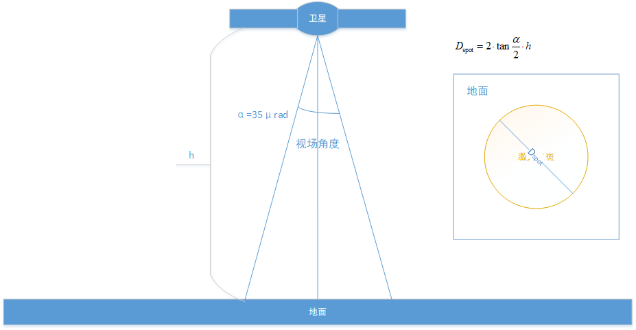

比如，对于卫星`ZY-3(03)`的参数，

|      参数      |   符号   |     数值     |
| :------------: | :------: | :----------: |
|     发散角     | $\alpha$ | $100\mu rad$ |
|   单脉冲能量   |   $E$    |   $180mJ$    |
| 发射系统透过率 | $\eta_t$ |    $0.9$     |
| 接收系统透过率 | $\eta_r$ |    $0.67$    |

$$
D_{spot}=2\cdot\tan\frac{100\times10^{-6}}{2}\cdot h
$$

### 光强分布

一元高斯分布表达式为
$$
f(x)=\frac{1}{\sqrt{2\pi}\sigma}e^{-\frac{(x-\mu)^2}{2\sigma^2}}
$$
其中，$x\in(-\infty,\infty)$

激光的强度分布呈现高斯分布，即在$x,y$方向上为独立同分布，表达式为
$$
p(x,y)=\frac{1}{2\pi\sigma^2}e^{-\frac{1}{\sigma^2}((x-\mu)^2+(y-\mu)^2)}
$$
在这里，我们只是想仿真激光的光强分布，不关心其具体位置，所以令$\mu=0​$，得到
$$
P(x,y)=\frac{1}{2\pi\sigma^2}e^{-\frac{1}{\sigma^2}(x^2+y2)}
$$
所以对于分布函数而言。仅有$\sigma$未知。

激光光强为
$$
P_{sum}=E\cdot t\cdot \xi
$$
其中，$E​$表示激光脉冲能量，$t​$为激光光束在大气传输的效率，高斯光束的束腰为距离中心$\xi=1-\frac{1}{e^2}=86.4\%​$，从激光脉冲光斑图形中心到高斯分布的束腰处的距离认为是激光光斑的边缘。

所以，平均光强为
$$
P_{avg}=\frac{E_{sum}}{\pi(P_{spot}/2)^2}
$$
使用卫星`ZY-3(03)`进行模拟，假设大气透过率$t=0.7$，则
$$
P_{sum}=E\cdot t\cdot \xi=180\times0.7\times0.864=108.864
$$
且对于$x,y$方向满足独立高斯分布，假设光斑大小$D_{spot}=70m$，则说明激光的$86.4\%$体积所包括的地方为$D_{apot}$

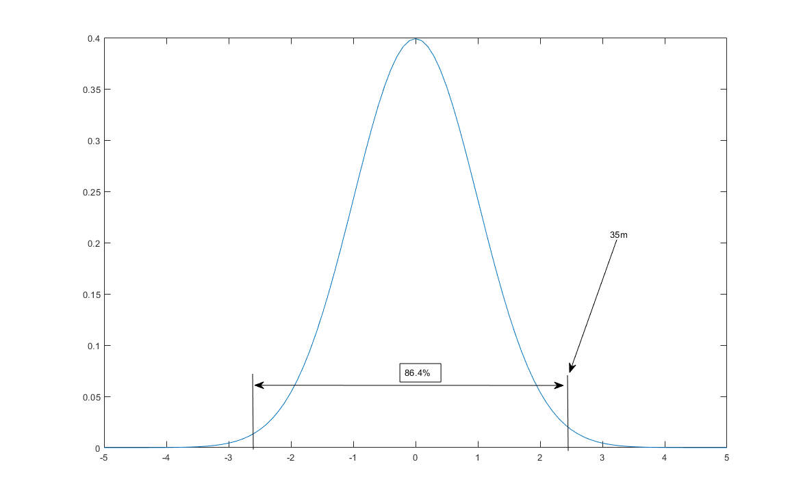

计算的过程中，由于$x,y​$是对称的同分布，是一个中心对称和轴对称图形，所以可以从二元变量的积分求解简化为对一元变量的积分求解，
$$
f(\sigma)=\int_0^{35}\frac{1}{\sqrt{2\pi}\sigma}e^{\frac{x^2}{2\sigma}}=\frac{1-1/e^2}{2}
$$
通过上式求出$\sigma​$的值也就可以得到激光光强的分布情况。

> **正态分布的分布函数$\Phi(x)$没有解析表达式**，它的值可以通过[数值积分](https://zh.wikipedia.org/wiki/%E6%95%B8%E5%80%BC%E7%A9%8D%E5%88%86)、[泰勒级数](https://zh.wikipedia.org/wiki/%E6%B3%B0%E5%8B%92%E7%BA%A7%E6%95%B0)或者[渐进序列](https://zh.wikipedia.org/w/index.php?title=%E6%BC%B8%E9%80%B2%E5%BA%8F%E5%88%97&action=edit&redlink=1)近似得到。

所以我们需要进行查正态分布函数表解决这个问题，从上式来看，先求出对于标准正态分布的值，即对于$x\sim N(0,1)​$时候的$x​$所占的值。即
$$
\Phi(x)-\Phi(-x)=1-\frac{1}{e^2}
$$
又
$$
\Phi(-x)=1-\Phi(x)
$$
则变为
$$
2\Phi(x)-1=1-\frac{1}{e^2}
$$
解得
$$
\Phi(x)=1-\frac{1}{2e^2}=0.9323
$$
查找得到，
$$
\Phi(1.49)=0.9319\\
\Phi(1.50)=0.9332
$$
使用线性差值计算
$$
\frac{y_2-y_1}{x_2-x_1}=\frac{y-y_1}{x-x_1}
$$
计算得到
$$
x=\frac{x_2-x_1}{y_2-y_1}(y-y_1)+x_1=\frac{1.50-1.49}{0.93321-0.9319}(0.9323-0.9319)+1.49=1.493
$$
此时$\sigma=1,x=1.493$，对于$x'=35​$，
$$
\frac{x}{\sigma}=\frac{x'}{\sigma'}\rightarrow\sigma'=\frac{x'}{x}\sigma=\frac{D_{spot}}{2.986}
$$
得到$\sigma'=23.4427$，则强度分布为，
$$
P(x,y)=\frac{P_{sum}}{2\pi\sigma^2}e^{-\frac{1}{\sigma^2}(x^2+y2)},\sigma=23.4427,P_{sum}=108.864
$$
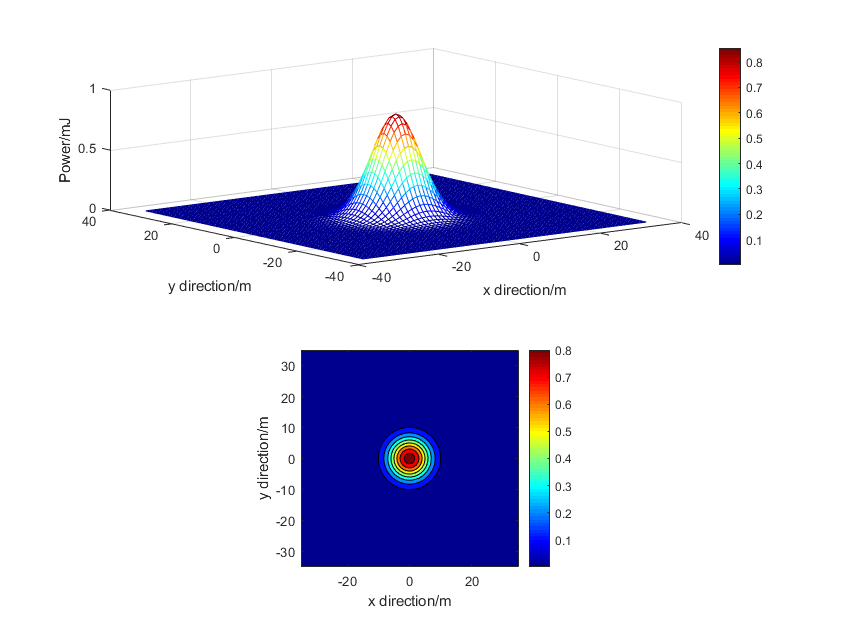

密度计算为，
$$
P_{density}=\sum_iP_i(x,y)/\sum i
$$
计算得到的光强分布与光强密度分布为

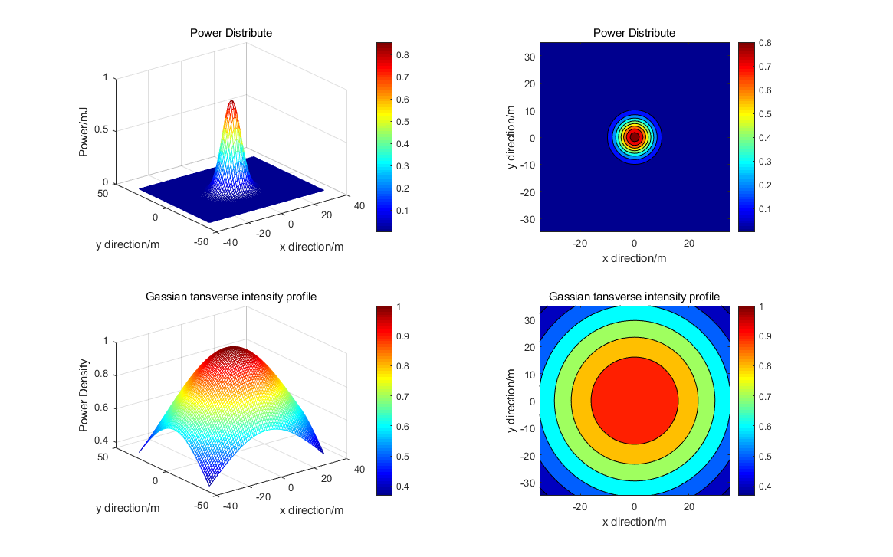

### 接收器分布仿真

#### 仿真原理

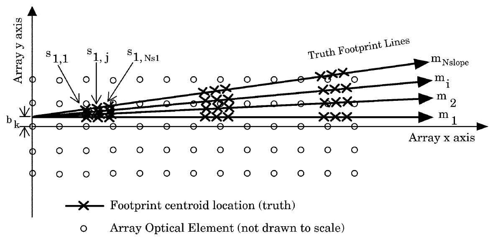

在对接收器仿真的时候，有四个变化的参数，

|               参数                |   符号   |   单位   |
| :-------------------------------: | :------: | :------: |
|         探测点之间的距离          | $\Delta$ |   $m$    |
|     $x$方向，第一个足印的质心     |  $s_1$   |   $m$    |
|    $y$方向，纵向移动直线的截距    |   $b$    |   $m$    |
| $k$斜率，控制在平面上所运行的方向 |   $m$    | $^\circ$ |

在一次仿真中，探测器摆放点之间的距离不改变，即$\Delta=const​$。

计算总的平均误差为，
$$
TMO=\frac{1}{N_mN_bN_{s_1}}\sum_{n=1}^{N_{s_1}}\sum_{j=1}^{N_m}\sum_{k=1}^{N_b}MEAN_{jkn}
$$
$TMO​$是对于一个足印仿真一次计算的总平均误差，在仿真中可以采用多个足迹共同仿真，假设采用$N_{fp}​$个足迹一起仿真，那么对于每个位置，都有
$$
MEAN_{jkn}=\frac{1}{N_{fp}}\sum_{i=1}^{N_{fp}}O_{ijkn}\\
O_{ijkn}=distance(Real_{ijkn}-Cal_{ijkn})
$$
在计算完这个之后，可以求得其标准差，
$$
TMSD=\sum_{n=1}^{N_{s_1}}\sum_{j=1}^{N_m}\sum_{k=1}^{N_b}\{\sum_{i=1}^{N_{fp}}\frac{(O_{ijkn}-MEAN_{jkn})^2}{N_{fp}}\}^{1/2}
$$
在仿真中，由于探测器的直径与其摆放的距离之间，与激光光斑大小之间相差几个数量级，所以将探测器简化为质点，仅具有位置属性，而不具有大小。摆放的探测器理想化为点阵。

探测器计算的中心使用质心法计算，探测器接收到的值为`0`，`1`两种选项，在计算的时候，找出响应为`1`的探测器的中心位置，即计算的质心所在位置，即
$$
x_o=\frac{1}{n}\sum_{i=1}^nx_i\\
y_o=\frac{1}{n}\sum_{i=1}^ny_i\\
$$
比如，有三个点$A(x_1,y_1),B(x_2,y_2),C(x_3,y_3)$响应为`1`，那么其计算的质心坐标为
$$
x_o=(x_1+x_2+x_3)/3\\
y_o=(y_1+y_2+y_3)/3
$$

#### 仿真过程

仿真参数，

|               参数                |   符号   |   单位   |       数值       |      参数个数      |
| :-------------------------------: | :------: | :------: | :--------------: | :----------------: |
|         探测点之间的距离          | $\Delta$ |   $m$    |    $15:1:35$     |  $N_{\Delta}=21$   |
|     $x$坐标，第一个足印的质心     |  $s_1$   |   $m$    | $35:1:35+\Delta$ | $N_{s_1}=\Delta+1$ |
|        $y$坐标，直线的截距        |   $b$    |   $m$    |   $0:1:\Delta$   |   $N_b=\Delta+1$   |
| $k$斜率，控制在平面上所运行的方向 |   $m$    | $^\circ$ |     $0:1:15$     |      $N_m=16$      |

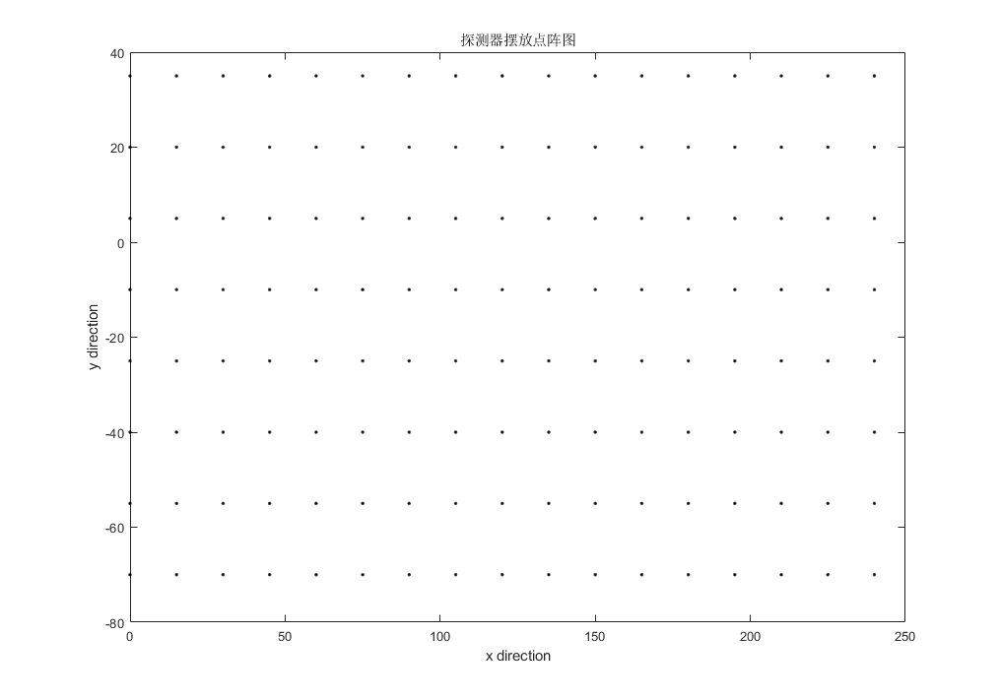

探测器的摆放如图所示，
$$
x\in[0,240]\\
y\in[-70,35]\\
grid=\Delta
$$
质心坐标为$centroid_{first}(35,-\Delta)$，质心构成   的圆的直径大小为$centimeter=70m$。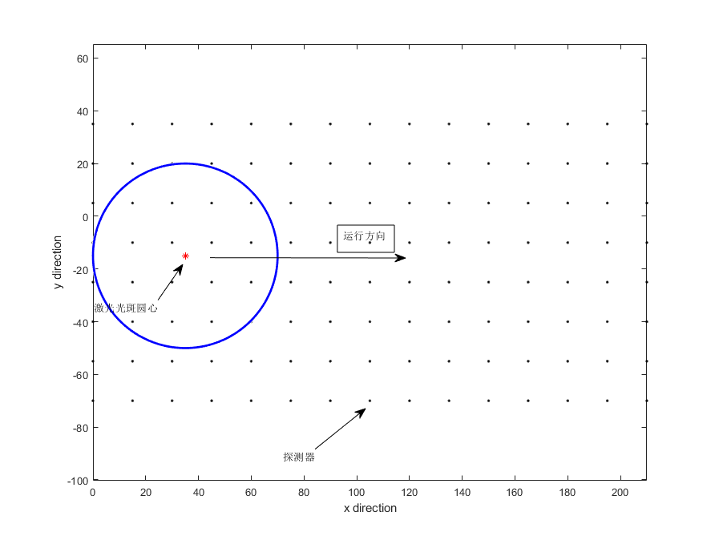

#### 仿真结果

##### 单个圆的仿真结果

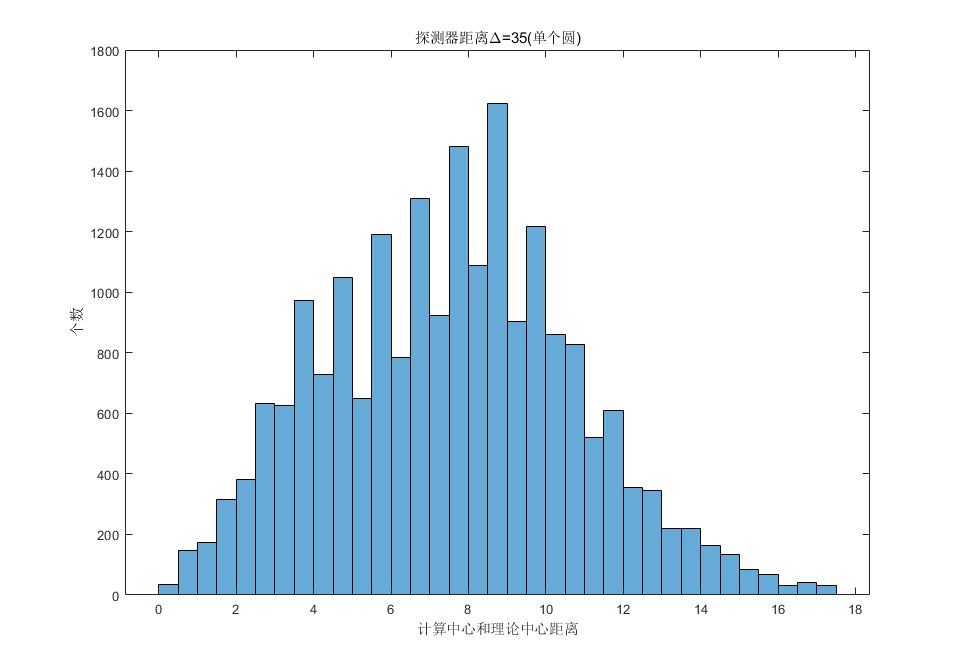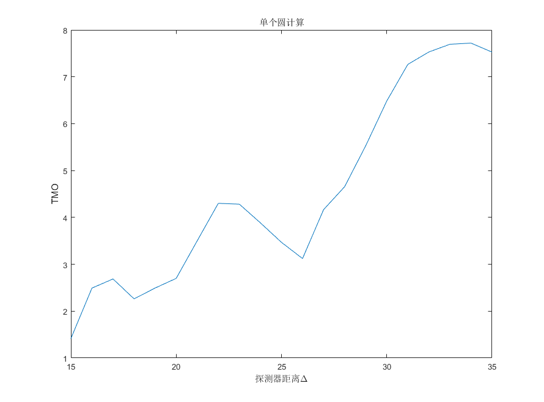

##### 三个圆的仿真结果

计算时间（双重循环）：时间已过 20.774403 秒。

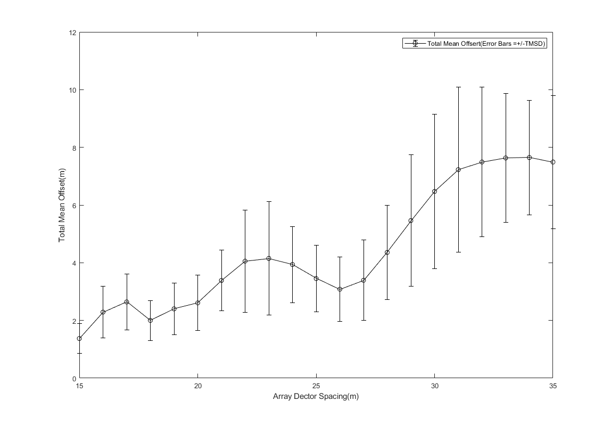

使用循环计算（4层）：（计算用时：时间已过 125.620212 秒。）

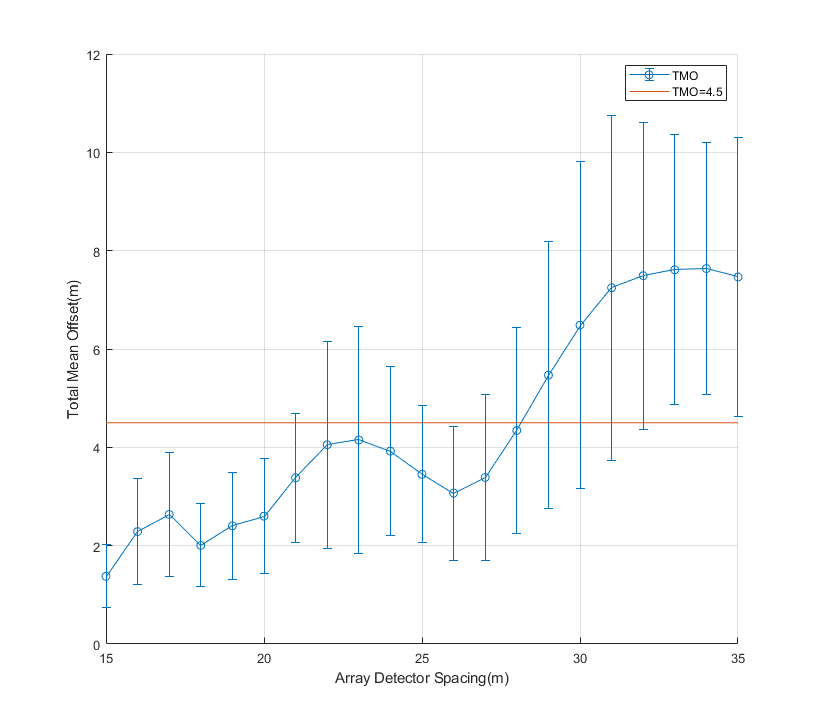

计算时间（优化的双层循环）：时间已过 8.945614 秒。

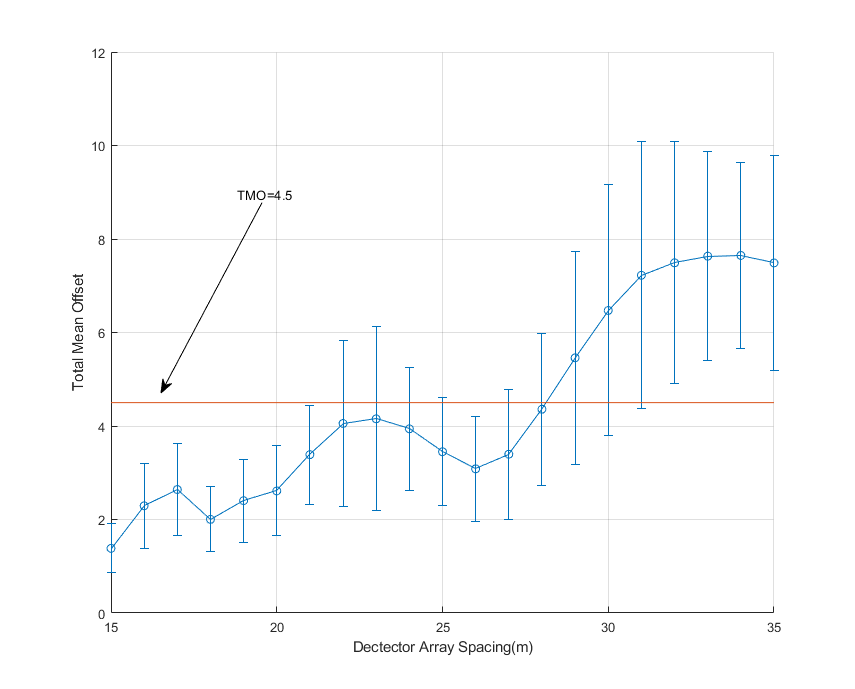

未经优化的双层循环在`calError`

```matlab
    error = zeros(1,length(circle_xy)); % 循环前预分配内存    
     for i = 1:length(circle_xy)
         tmp = repmat(circle_xy(:,i),1,length(point_xy));
         delta_xy = tmp - point_xy;
         distance = sqrt(delta_xy(1,:).^2+delta_xy(2,:).^2);
         index = distance<=35;
         use_point_xy = point_xy;
         use_point_xy(:,~index)=nan;
         cal_xy = mean(use_point_xy,2,'omitnan');
         error(i) = sqrt((circle_xy(1,i)-cal_xy(1))^2+(circle_xy(2,i)-cal_xy(2))^2);
     end
```

经过优化的双层循环`calError`

```matlab
    dis = pdist2(point_xy',circle_xy');
    isincircle = dis<35;
    [~,circlecount] = size(dis);
    numnozero = sum(isincircle);
%     calcircle = zeros(2,cicrlecount);
    for col = 1:circlecount
        pointin = repmat(isincircle(:,col),1,2).*point_xy';
        calcircle(col,:) = sum(pointin)./repmat(numnozero(col),1,2);
    end
    err = calcircle - circle_xy';
    error = abs(err(:,1)+err(:,2)*1i);
```

循环计算的全部代码`loopCal`

```matlab
% test_loop
clear;clc
tic
delta_range = 15:1:35;
for delta = delta_range
% delta = 20;
detectorx = 0:delta:500+delta;detectory = -40:delta:420+delta;
[X,Y] = meshgrid(detectorx,detectory);
detectorxy = [reshape(X,numel(X),1),reshape(Y,numel(Y),1)];
for b=0:1:delta
    for m=0:1:30
        for s1=35:1:delta+35
            start1_l = s1;start1_y = b;
            start2_l = s1+170;start2_y = b;
            start3_l = s1+170*2;start3_y = b;
            % rotate togrther
            current1_x = start1_l*cos(m*pi/180);
            current1_y = start1_y+start1_l*sin(m*pi/180);
            current2_x = start2_l*cos(m*pi/180);
            current2_y = start2_y+start2_l*sin(m*pi/180);
            current3_x = start3_l*cos(m*pi/180); 
            current3_y = start3_y+start3_l*sin(m*pi/180);
            % x change
%             current1_x = start1_l;
%             current1_y = start1_y+current1_x*tan(m*pi/180);
%             current2_x = start2_l;
%             current2_y = start2_y+current2_x*tan(m*pi/180);
%             current3_x = start3_l;
%             current3_y = start3_y+current3_x*tan(m*pi/180);
            
            dis1 = pdist2(detectorxy,[current1_x,current1_y]);
            dis1 = mean(detectorxy(dis1<35,:));
            error1 = norm(dis1-[current1_x,current1_y]);
            dis2 = pdist2(detectorxy,[current2_x,current2_y]);
            dis2 = mean(detectorxy(dis2<=35,:));
            error2 = norm(dis2-[current2_x,current2_y]);
            dis3 = pdist2(detectorxy,[current3_x,current3_y]);
            dis3 = mean(detectorxy(dis3<35,:));
            error3 = norm(dis3-[current3_x,current3_y]);
            error(b+1,m+1,s1-35+1) = mean([error1,error2,error3]);
            std_all(b+1,m+1,s1-35+1) = std([error1,error2,error3]);
        end
    end
end
TMO(delta-14) = mean(error,'all');
TMSD(delta-14) = mean(std_all,'all');
end
toc
```

## GUI开发

`界面1.0`

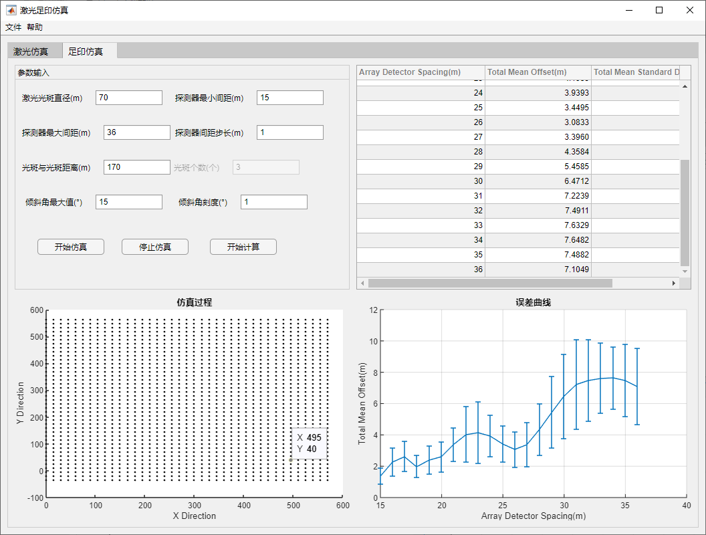

`界面1.1`

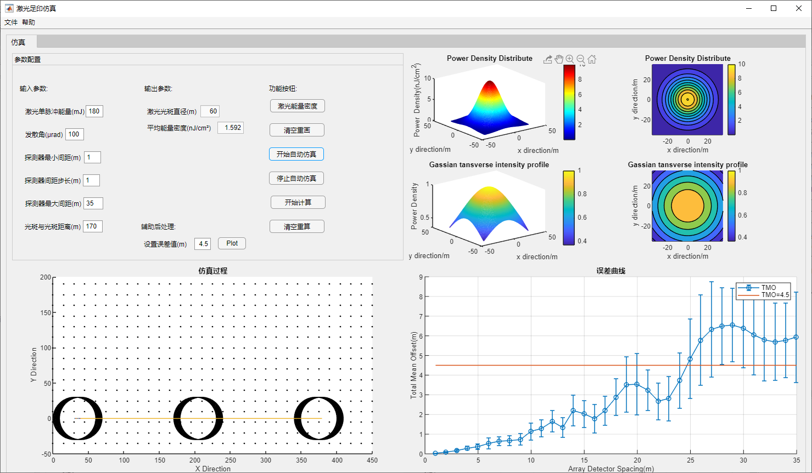